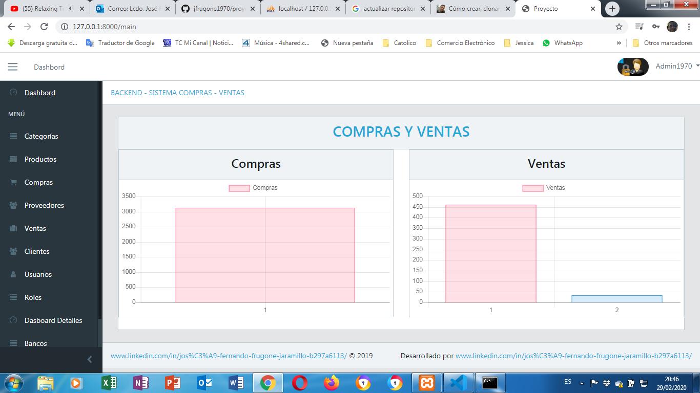

# Proyectolaravel

  

Sistema de Compras y Ventas en Laravel 5.7, Vue.js y Bootstrap
El presente proyecto de Sistema de Compra y Venta de productos esta desarrollado en el framework de Laravel 5.7, Vue.js, y Boottraps es un sistema de Venta de productos, comprende los siguientes módulos:

  

1) Categoría
2) Productos
3) Clientes
4) Proveedores
5) Compras
6) Ventas

Para lo que se refiere a categoría se refiere a la categoria de productos
Para lo que es los productos para el manejo de los productos
Para lo que se refiere a Cliente para el manejo de Catálogo de clientes
Para lo que se refiere a Proveedores para el manejo de Catalogo de Proveedores
Para las Compras para las Compras que se realiza a los Proveedores
Para las Ventas las transacciones mercantiles de ventas que se realizan
Ahora bien para eso se va a explicar la instalación de Laravel para dar mas explicación mas adelante del proyecto:

Instalación de Laravel
Requísitos del servisor

El marco Laravel tiene algunos requisitos del sistema. La máquina virtual Laravel Homestead cumple todos estos requisitos , por lo que es muy recomendable que utilice Homestead como su entorno de desarrollo local de Laravel.

Sin embargo, si no está utilizando Homestead, deberá asegurarse de que su servidor cumpla con los siguientes requisitos:

PHP> = 7.1.3
Extensión PHP OpenSSL
PDO PHP Extension
Extensión PHP Mbstring
Tokenizer PHP Extension
Extensión XML PHP
Extensión PHP Ctype
Extensión PHP JSON
Extensión PHP BCMath

Instalando Laravel .- Laravel utiliza Composer para gestionar sus dependencias. (https://getcomposer.org/) Vía instalador de Laravel
Primero, descargue el instalador de Laravel usando Composer:

composer global require laravel/installer

Una vez instalado, el comando creará una nueva instalación de Laravel en el directorio que especifique. Por ejemplo, creará un directorio llamado que contiene una nueva instalación de Laravel con todas las dependencias de Laravel ya instaladas:laravel newlaravel new blogblog

Esta informacion es obtenida en el manual de Laravel

<a href="https://laravel.com/docs/5.7" target="_blank">Manual de Laravel - dar click para mayor informacion</a>

laravel new blog

Servidor de desarrollo local
Si tiene PHP instalado localmente y desea utilizar el servidor de desarrollo integrado de PHP para servir su aplicación, puede usar el servecomando Artisan. Este comando iniciará un servidor de desarrollo en :http://localhost:8000

php artisan serve

Configuración

Directorio publico
Después de instalar Laravel, debe configurar el documento / raíz web de su servidor web para que sea el publicdirectorio. El en este directorio sirve como controlador frontal para todas las solicitudes HTTP que ingresan a su aplicación.index.php

Archivos de configuración
Todos los archivos de configuración para el marco de Laravel se almacenan en el configdirectorio. Cada opción está documentada, así que siéntase libre de revisar los archivos y familiarizarse con las opciones disponibles para usted.

Clave de aplicación
Lo siguiente que debe hacer después de instalar Laravel es configurar su clave de aplicación en una cadena aleatoria. Si instaló Laravel a través de Composer o el instalador de Laravel, el comando ya ha configurado esta clave para usted .php artisan key:generate

Por lo general, esta cadena debe tener 32 caracteres de longitud. La clave se puede establecer en el .envarchivo de entorno. Si no ha cambiado el nombre del archivo , debe hacerlo ahora. Si la clave de la aplicación no está configurada, sus sesiones de usuario y otros datos cifrados no serán seguros..env.example.env

Configuración del servidor WEB

apache
Laravel incluye un archivo que se utiliza para proporcionar URL sin el controlador frontal en la ruta. Antes de servir Laravel con Apache, asegúrese de habilitar el módulo para que el servidor cumpla con el archivo.public/.htaccessindex.phpmod_rewrite.htaccess

Si el .htaccessarchivo que se incluye con Laravel no funciona con su instalación de Apache, pruebe esta alternativa:

Options +FollowSymLinks -Indexes
RewriteEngine On

RewriteCond %{HTTP:Authorization} .
RewriteRule .* - [E=HTTP_AUTHORIZATION:%{HTTP:Authorization}]

RewriteCond %{REQUEST_FILENAME} !-d
RewriteCond %{REQUEST_FILENAME} !-f
RewriteRule ^ index.php [L]

Para mayor información visita la página WEB

<a href="https://laravel.com/docs/5.7" target="_blank">Instalacion de Laravel - dar click para mayor informacion</a>

Para poder correr mi proyecto de Laravel debes de cambiar el puerto de configuración en el apache de xampp.
Debes de ejecutar xampp como Administrador
Una vez que ejecutes el xampp como administrador, en la ventana del Panel de Control del xampp en el botón config seleccionar Apache (httpd.conf), que se abre el archivo httpd.conf

En la ventana de Editor de Edición dar un click en buscar e indicar 8080; así de esta manera

#Listen 12.34.56.78:8080
Listen 8080

ServerName localhost:8080.

En la ventana de xampp control panel dar un click en config (en el boton de configuracion), seleccionar apache y mysql
Seleccionar "Service and Port Setting" (Servicios y Configuracion de Puertos)

En Apache dejarlo en puerto principal 8080 (main port), y luego guardar.

Si quieres entrar a mi proyecto de laravel el usuario del proyecto es:
Usuario: Admin1970
Clave:   Josue2019

Para eso si estas usando el aplicativo xampp, el proyecto lo debes de descargar a la carpeta c:/xampp/htdocs/proyectolaravel 
es decir dentro de la carpeta htdocs de xampp debe estar registrado el proyecto laravel

Para descargar la base del proyecto esta en el siguiente link o enlace:

https://github.com/jfrugone1970/base_proyectolaravel

